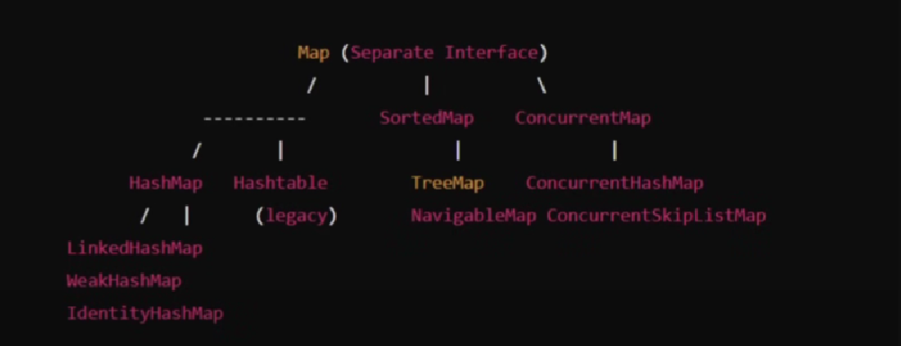

Java_CollectionFramework.collectionFramework.Lists -Interface
The Java_CollectionFramework.collectionFramework.Lists interface is implemented by several classes in the java
collection framework, such as Java_CollectionFramework.collectionFramework.Lists.ArrayLists, Java_CollectionFramework.collectionFramework.Lists.ArrayLists.ArrayLists.LinkedList, Java_CollectionFramework.collectionFramework.Lists.Vector and Java_CollectionFramework.collectionFramework.Lists.Stack.
Features:
1. Order Preservation
2. Indexed Based Access
3. Allows Duplicates

1. Java_CollectionFramework.collectionFramework.Lists.ArrayLists : is a resizable array implementation of the Java_CollectionFramework.collectionFramework.Lists Interface.

COMPARATOR(INTERFACE)
1. CUSTOM ORDERING -->

